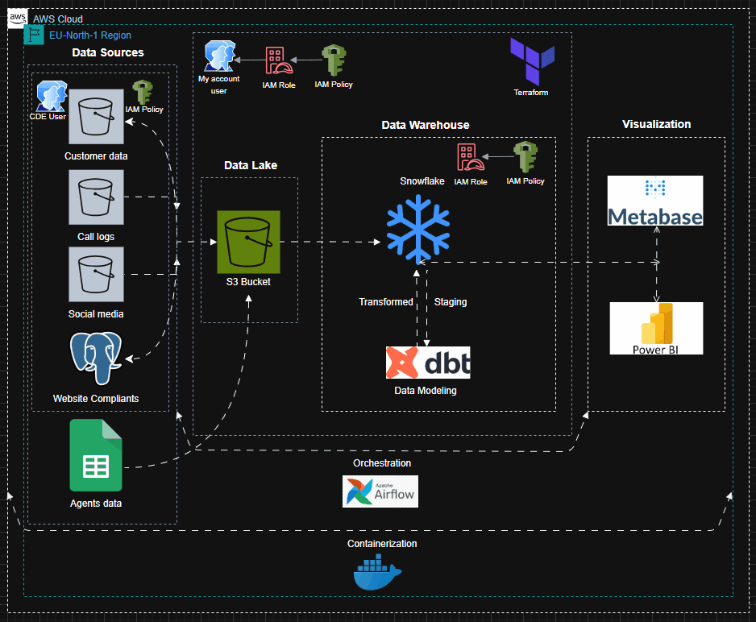

# Telecom ELT Data Pipeline

## Project Overview

This project implements a robust ELT (Extract,  Load, Transform) pipeline for a telecom company’s data. The pipeline integrates multiple data sources including PostgreSQL, Google Sheets, and S3 buckets,load and processes the data into a Snowflake Data Warehouse using Parquet files.

 ### The system is designed for:

- Scalability: Supports large datasets via chunked reading and partitioned processing.
- Idempotency: Prevents duplicate data with deduplication and partition-aware loading.
- Automation: Fully automated using Apache Airflow.
- Observability: Detailed logging for monitoring ETL execution.

### Problem Statement

A leading telecom company, faces a customer retention crisis due to poor management of complaints from multiple channels: social media, call center logs, and website forms. Data is scattered in different formats, reports are manually compiled, and teams work in silos. This results in delayed insights, inefficient processes, and customer churn.

### Project Tech Stack
- Airflow
- Python
- Terraform
- Snowflake
- dbt
- Docker

### Project Archetecture

### Project Components

1. **Data Extraction**

The ETL pipeline extracts data from multiple sources:

- PostgreSQL

    - Extracts tables such as web_form_request for given execution dates.
    - Uses psycopg2 for connection and pandas for chunked reading.
    - Data is cleaned and enriched with metadata (source_system, ingestion_date).
    - Writes to S3 in Parquet format using awswrangler.

- Google Sheets

    - Extracts agents’ data via gspread and Google Service Account credentials.
    - Clean column names and adds metadata before loading to S3.

- S3 Raw Data

    - Extracts customers CSVs, call logs CSVs, and social media JSON files from a source S3 bucket.
    - Implements idempotency checks:
        - Tracks processed files in a processed_source_files.json tracker in the destination bucket.
        - Only new files are processed.
    - Supports chunked reading for memory efficiency.

2. **Data Standardization**

- Standardizes column names (lowercase, underscores, strip spaces).
- Adds metadata fields:
    - source_system >> identifies data source.
    - ingestion_date & ingestion_timestamp.
- Deduplicates data in Snowflake based on unique_keys.

### Project Infra Setup

The project provisions cloud infrastructure using terraform to support the production-grade ETL pipeline and secure Snowflake access to staged Parquet files:

**What is created**

1. S3 bucket cde-telecom-unified-bucket

    - Purpose: staging area for the source data in parquet file format and also stores the Terraform state file.

2. IAM role snowflake_s3_reader_role

    - Purpose: allows Snowflake to assume a role and read objects from the S3 staging bucket.

    - Uses an ExternalId condition to secure cross-account access.

    - The role is assumable by the specified AWS principal

3. IAM policy (snowflake_dedicated_policy)

    - Grants S3 read/list/get permissions on the bucket and objects (s3:GetBucketLocation, s3:ListBucket, s3:GetObject).

    - Attached to the Snowflake IAM role.

4. Snowflake resources:

    - File format MY_PARQUET_FORMAT defines Parquet format, null handling, compression.

    - Storage integration S3_WAREHOUSE_INTEGRATION: Snowflake integration linked to the IAM role allowing Snowflake to access S3.

    - Stage TELECOM_SNOWFLAKE_STAGE: points Snowflake to s3://cde-telecom-unified-bucket/staging/ so COPY/MERGE operations can load Parquet files directly.

### Continuous Integration and Continuous Development
This project uses GitHub Actions for continuous integration and continuous deployment. Two main workflows are configured:

- CI: Code Quality

Runs on pushes and pull requests to main. Also supports manual dispatch. Ensures Python code is formatted using Black.

If formatting issues are detected the workflow auto-formats the code and commits/pushes the changes.

- CD:  Build and Push Docker

Triggers on changes to main, limited to files that affect the runtime image (e.g., Dockerfile, extract_folder/*, snowflakes/**).

Builds Docker images tagged as latest and by the commit SHA, then pushes them to Docker Hub.